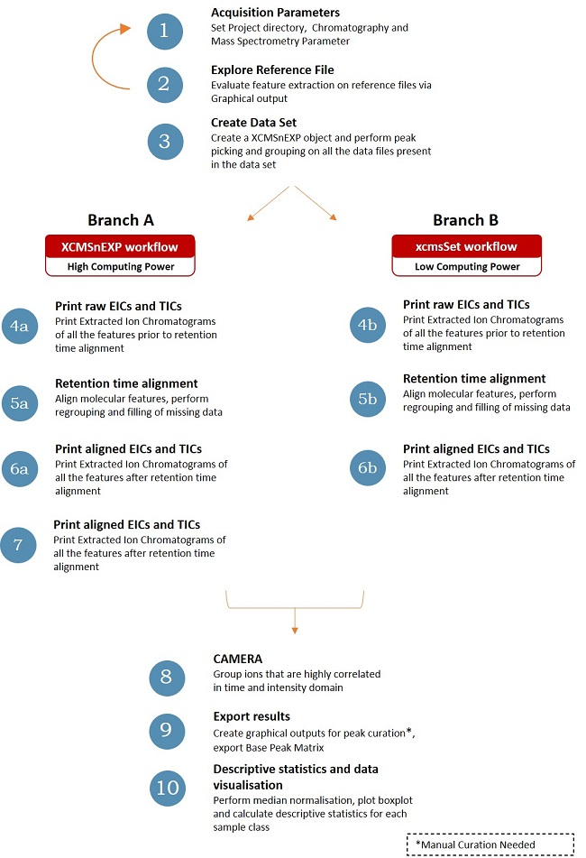
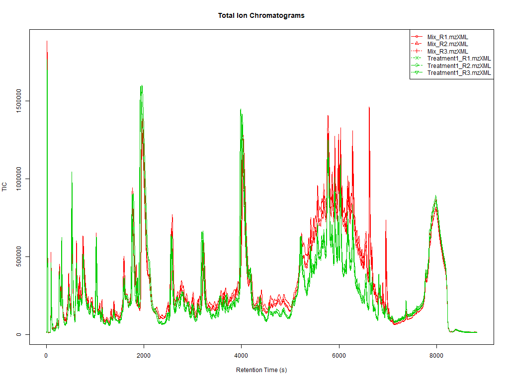
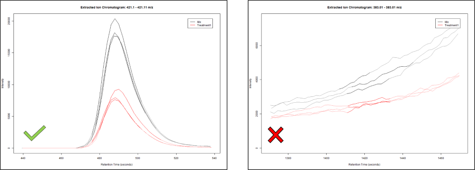

## _Introduction_

**MStractor** combines the functions for molecular feature extraction present
in XCMS and CAMERA with user friendly dedicated GUIs for LC and MS parameter
input, graphical QC outputs and descriptive statistics calculations.

A schematic representation of the workflow is displayed in **Figure 1**,
reported below.
The workflow consists of 10 steps with the possibility of running the workflow
using either the most recent xcms functions specific for *XCMSnExp* object
(available from xcms verison 1.51.5)
(**branch a**) or the set of functions for  *xcmsSet* objects
(**branch b**).
The 2 branches perform the same data processing steps and produce
similar outputs, however, it is reccomende to use most recent xcms functions.
Branch a is for a high computing power environment, whereas branch b is
suitable for low computing power environments.
Specifically, the authors observed that step **6a** tends to
be quite time-consuming in particular whendealing with complex data set.
Therefore, in a case where computing power is limited and the data set
is large, the authors suggest using branch b of the workflow.
It is ,however, reccomended to follow branch a and use the most updated
xcms functions.
Step 8 is common to both branches,
where the data set is processed using CAMERA.
Since the latest release available for CAMERA does not support
XCMSnEXP objects, the data set object is required to be converted to the
xcmsSet format prior to this step.

---



**Figure 1** : Schematic representation of MStractor Workflow

---

Each step of the framework displayed in Figure 1 involves using 1 or more
functions. MStractor functions can be classified into 3 different groups:

**1.MStractor specific functions**: developed by the authors to provide
the user with a friendly and seamless experience. The functions belonging
to this class mainly involve the use of GUIs allowing parameter input and
storage to be used later in the workflow. This group also include functions
to normalise data and calculate descriptive statistics.

**2.Wrapper functions**: includes wrapper functions of xcms and
CAMERA. The function backbone is the xcms (or CAMERA) function and additional
code is used to automate routine operations, reduce parameter input errors
and produce graphical outputs within the selected working directory.


**3.xcms and CAMERA functions**: these functions are basic CAMERA and xcms
functions that are used along the workflow. However, the user is not required
to update the function arguments because all the necessary parameters are
input in the previous steps of the workflow

## _Data Preparation and File Naming_

Preparing the data and creating the correct working directory and folder
structure (outside the R environment) is required prior to executing
the workflow. The raw data files need to be converted to an appropriate
format which can be  easily achieved using various tools freely  available,
such as Proteowizard (ProteWizard, http://proteowizard.sourceforge.net/).
MStractor supported file formats include mzDATA, mzML and mzXML.
After conversion, files should be grouped in folders according to their
class of belonging. Every class-folder needs to be stored within the
directory ‘MSfiles’. The script will use the ‘MSfiles’ subfolder
downstream to automatically determine the sample classes required
for processing.
If the folder ‘MSfiles’ is not present, the user will encounter errors.
For each class-folder a minimum of 2 replicates is required.
An example dataset (see Figure 2) is provided with the package.


**Figure 2** : Project subfolder structure

File naming is a key aspect for correct visualisation of graphical
output downstream.
A specific function of the workflow assigns different colours
and symbols to the different sample classes.
In this respect, the filename has to  correspond to the folder name followed
by an underscore and a number inidicating the biological replicate,
as displayed in **Figure 2**.

## _Installation _
It is recommended to install the dependency xcms from source.
To install the package from GitHub, make sure the package 'remotes'
is installed and run the following,

```{r install_pacakge, eval=FALSE}

BiocManager::install("xcms", type='source')

library(remotes)

Sys.setenv(R_REMOTES_NO_ERRORS_FROM_WARNINGS="true")

# install from github
remotes::install_github("MetabolomicsSA/MStractor")

# Alternatively, Download the tar.gz package from
# https://github.com/MetabolomicsSA/MStractor/releases
# and run the following

library(remotes)

Sys.setenv(R_REMOTES_NO_ERRORS_FROM_WARNINGS="true")

setRepositories(ind=1:2)

remotes::install_local("C:/pathtoPackage/MStractor_0.1.0.tar.gz",
    dependencies=NA)

```
After successful installation, load the MStractor library.

```{r load_library, message=FALSE, warning= FALSE}
library(MStractor)

```
## 1. _Acquisition Parameters_

The first step of the workflow consists of running 6 functions that allow
the input of chromatographic, mass spectrometry and peak picking parameters
as well as loading the data and automatically defining the visualization
settings for graphical QC outputs.

The default input values provided in thepackage functions are based
on the settings of the acquisition instrument used by the authors and,
therefore, suitable for processing the example data set available
within the package.
These values should be optimised for the user’s
LCMS system configuration, since they can dramatically influence
the data processing outcome.

### 1.1 _Define Working Directory and Reference Files_
The function 'Project()' doesn’t require arguments.
Its execution opens a GUI (Figure 3) allowing the selection of the working
directory and 2 reference files chosen from one of the folders within the
MSfiles directory such as 2 pooled biological QC replicates(labeled as 'Mix'
in the example data set).
The function also creates a QC folder, that stores the graphical outputs
to evaluate and QC input parameters at various steps of the workflow.

```{r define_project, eval=FALSE}

Project()
#If using the example dataset provided within the package set the
#working directory and click 'cancel' on the following 2 R-prompts asking
#to define refernce files
```
use the following lines of code to load the example dataset:
```{r load_package_dataset, message=FALSE}
path<-system.file("extdata",package = "MStractor")
files <- dir(path, pattern = ".mzXML", full.names = TRUE)

```


**Figure 3: GUI for project folder selection**

### 1.2 _Input of Chromatographic and Mass Spectrometry Parameters_

ChromParam() allows the user to input the chromatographic parameters
related to the analytical data set to be processed and that will be
stored and used in the later stages of the workflow.
The values to be entered are the retention time range of the data set
(rt start and rt end), the maximum retention time drift observed
(rtDelta) and the minimum and maximum fullwidth at half maximun
(FWHM min and max).

MassSpecParam()  is mainly used to input mass spectrometry related parameters.
The criteria to be entered are the acquisition mode (negative as default);
the mass range to be considered (mz start and mz end); the number
of expected charges (default value set at 3);
the maximum number of chromatographic peaks (EICsMax) expected for a single EIC
,the sensitivity and the file type (default set to ‘.mzXML’) .

Values are entered using GUIs as displayed in Figure 4.

Both the functions return the input parameters.

For more details about the parameters consult the xcms
manual:
https://www.bioconductor.org/packages/release/bioc/manuals/xcms/man/xcms.pdf )

```{r eval= TRUE}
#leave default values if using the example dataset included in the package

ChromParam()

MassSpecParam()

```


**Figure 4: Example of GUI input parameters**


### 1.3 _Load the Dataset_
The function returns a  list of the loaded files. It creates
a timestamp tracking the amount of time to complete the data processing and
creates the object ‘ClassType’ which associates every data file with
the class of belonging.

```{r eval=FALSE}
#Skip this step if using the example dataset provided within the package
LoadData()
```


### 1.4 _Define Class Identifiers_

The argument of the function is the object ‘ClassType’. The function defines
and returns specific symbols and colours for each sample class,
which  are then used to produce graphical outputs.

```{r eval=TRUE}
## don't run if using the the provided example dataset

ClassType<-c('Mix','Treatment1')

DefineClassAttributes(ClassType)
```


### 1.5 _Define Peak Picking Parameters_

The function uses GUIs to define xcms peak picking parameters using
the centwave algorithm. These include: minimum and maximum peakwidth,
minimum and maximum m/z error (in ppm), values for the integration
threshold (set at 2000) and signal to noise threshold.
The pick picking can be set to gaussian and the integration
method can be 1 or 2, as for the xcms documentation.
The default values for minimum and maximum m/z error and signal to noise
(S/N) threshold are set to ‘none’ and correspond, respectively,
to 3.03 and 50 ppm  and to 1000 for S/N value.
Detailed information about the mentioned parameters
can be found in the xcms documentation. https://www.bioconductor.org/packages/
release/bioc/manuals/xcms/man/xcms.pdf

```{r eval=TRUE}
#leave default values if using the package dataset
PeakPickingParam()

```


## 2. _Parameter Evaluation_

This is a QC step that allows testing the suitability of the input parameters
on the reference files selected in the first step.

First, a GUI is used to define the settings of xcms functions findChromPeaks
and groupChromPeaks which perform peak picking and grouping of
molecular features. Secondly, data files are read using
the xcms function readMSData and, lastly, peak picking and grouping
is carried out. The output of the function is the XCMSnEXP object ‘x_refs’.


```{r eval=FALSE}
#not to be executed if using the example  dataset
exploreRefs()

```

Note: In case the example dataset is used, the following needs to be run.

```{r eval=TRUE, message=FALSE, results='hide',warning=FALSE}
dir.create("./QC")
SampleGroup<-c("Mix", "Mix")
symbol<-c(1,1)
ClassCol<-c("#FF0000FF", "#FF0000FF")
path<-system.file("extdata",package = "MStractor")
files <- dir(path, pattern = ".mzXML", full.names = TRUE)
test<-files[1:2]
pd <- data.frame(sample_name = sub(basename(test), pattern = filetype,
    replacement ="", fixed = TRUE),sample_group = SampleGroup,
    stringsAsFactors = FALSE)
ref_data <- readMSData(test, pdata = new("NAnnotatedDataFrame",
    pd), mode = "onDisk")
expRefData(ref_data)
```

The refTic function returns  a  plot of the overlaid TICs for the reference
files


```{r eval=TRUE, message=FALSE, warning=FALSE}
refTic(x_refs)
```


**Figure 5: Non-aligned overlaid TICs **

The get100 function  randomly picks 100 features detected across
the retention time domain and plots them into a matrix. Using this output,
it is easy to check whether all the features are correctly integrated.


```{r eval=TRUE, message=FALSE, results='hide'}
get100(x_refs)
```


**Figure 6: EICs of 100 features randomly picked across the retention time**

## 3. _Create XCMSnExp Dataset_

An XCMSnEXP dataset containing all the raw files to be processed is
automatically created based on the folder structure defined in
the data preparation step.
The function performs the same steps described for exploreRefs(),
with the only difference that the processing is applied to the whole dataset.

It is important that the input parameters used in this step match the ones
defined for the reference files. After performing peak picking on each
datafile,peaks are matched across all samples and grouped using the xcms
functions
findChromPeaks and groupChromPeaks. The results are stored in the XCMSnEXP
object ‘xdata’


```{r eval=FALSE}
peakPickGroup() # don't run if using the example dataset
```

In case the example dataset is used, the following needs to be run

```{r eval=TRUE, results='hide', message=FALSE, warning=FALSE}
ClassType<-c('Mix', 'Treatment1')
SampleGroup<-c("Mix",        "Mix",        "Mix",
        "Treatment1", "Treatment1", "Treatment1")
symbol<-c(1 ,1, 1, 2,2, 2)
ClassCol<- c("#FF0000FF", "#FF0000FF", "#FF0000FF",
        "#00FFFFFF", "#00FFFFFF", "#00FFFFFF")
path<-system.file("extdata",package = "MStractor")
files <- dir(path, pattern = ".mzXML", full.names = TRUE)
pd <- data.frame(sample_name = sub(basename(files), pattern = filetype,
    replacement = "", fixed = TRUE), sample_group = SampleGroup,
    stringsAsFactors = FALSE)
raw_data <- readMSData(files =files, pdata = new("NAnnotatedDataFrame",
    pd), mode = "onDisk")
ppgExData(raw_data)

```


## __Workflow Branching__

The workflow forks at step 4 in branch a and branch b,
as displayed in **Figure 1**.
From this point on, the user can choose to either proceed with
the XCMSnEXP object or perform a conversion into a xcmsSet object.
Workflow branch A requires higher computing power than branch b.
**Branches** **a** and **b** should ot be run together.


## _Branch A_

### 4a _Print raw EICs and TICs_

Step 4 produces graphical outputs that can be used to visualise macroscopic
differences among chromatographic profiles.
For both branches plots of overlaid TIC (**Figure7**) chromatograms and for
individual EICs are stored in the QC directory.


```{r eval=TRUE, message=FALSE, results='hide', warning=FALSE}
OverlaidTICs(xdata, 'raw') #raw indicates non-retention time aligned signals
printEICs(xdata, 'raw')

```





**Figure 7: Overlaid TICs**


### 5a _Retention time alignment, grouping and peak filling_

Retention time correction parameters are entered via GUI.
The retention time alignment method currently supported
is ‘loess’ (see xcms manual), while Obiwarp will be possibly implemented
in the future MStractor releases. A plot of the retention time deviation
is also generated and stored in the QC folder.
After correction, features are regrouped and the filling of missing
signals is performed.

```{r eval=TRUE, message=FALSE, results='hide', warning=FALSE}
RTalign(xdata,'loess')

xdata <- groupChromPeaks(xdata, param = PeakDensityParam(sampleGroups =
        xdata$sample_group, minFraction = 0.3, bw = 20))

xfilled <- fillChromPeaks(xdata, param =(FillChromPeaksParam(ppm = 50,
        expandMz = 0.5)))

```

### 6a _Print aligned EICs and TICs_

Step 6 replicates the series of functions already described for step 4a,
with the only difference that retention time aligned TICs and
EICs are generated

```{r eval=TRUE, message=FALSE, results='hide', warning=FALSE}
OverlaidTICs(xdata, 'aligned')
printEICs(xfilled, 'filled')
#'aligned' and 'filled' indicate retention time aligned signals
```

### 7a _Create Summary Datamatrix_

Step 7 is specific for **branch a** and collates feature information
generated by the xcms featureDefinition() function with their corresponding
response (either the integrated peak area 'into' or maximum intensity'maxo').
The arguments of the function are the filled XCMSnEXP object and the type
of instrumental response desired (either ‘into’ or ‘maxo’).
After running step seven, the workflow merges again and the user has to proceed
with step 8.

```{r eval=TRUE}
CreateDM(xfilled,'maxo')
```

Following this, the xsetConvert function (already described in step 4)
reverts the XCMSnEXP object into the xcmsSet one.
This is necessary for using CAMERA in the subsequent steps.

```{r eval=TRUE}
xsetConvert(xfilled)
sampnames(xset)<-spn
```


## _Branch B_

The user needs to revert the object to a xcmsSet using the following code.
This is required to execute function listed in the remaining sections of
this document.

```{r eval=FALSE}
xsetConvert(xdata)
sampnames(xset)<-spn
```

### 4b _Print raw EICs and TICs_

```{r eval=FALSE}
getTICs(xcmsSet= xset, pngName= "./QC/TICs_raw.png", rt= "raw")
#raw indicates non-retention time aligned signals
printEICsXset(xset,'raw')

```


### 5b _Retention time alignment, grouping and peak filling_

Retention time correction parameters are entered via GUI.
The retention time alignment method currently supported
is ‘loess’ (see xcms manual), while Obiwarp will be implemented
in the future releases. A plot of the retention time deviation
is also generated and stored in the QC folder.
After correction, features are regrouped and the filling of missing
signals is performed.


```{r eval=FALSE}
RTalign_xset(xset,'loess')
xsAlign <- group(xsAlign, method= "nearest", mzVsRTbalance= 10, mzCheck=
        mzErrAbs,rtCheck= rtDelta, kNN=10)
xsFilled <- fillPeaks(xsAlign, method="chrom", expand.mz=0.5)
```

### 6b _Print aligned EICs and TICs_

Step 6 replicates the series of functions already described for stage 4,
with the only difference that retention time aligned TICs and
EICs are generated

```{r eval=FALSE}
getTICs(xcmsSet= xsAlign, pngName= "./QC/TICs_Aligned.png", rt= "corrected")
printEICsXset(xsFilled,'corrected')
# 'corrected' indicates retention time aligned signals
```


## __Workflow Merging__


## 8. _Spectra Reconstruction_

From step 8, the workflow is the same for branches **a** and **b**.
Spectra reconstruction is carried out using the function autoCAMERA()that
includes the 3 CAMERA functions groupFWHM(), findIsotopes() and groupCorr().
A GUI allows the input of the function parameters. Consult CAMERA manual
for more information:
https://www.bioconductor.org/packages/release/bioc/manuals/CAMERA/man/
CAMERA.pdf.
Using autoCamera, the peak table embedded within the xcmsSet object is
extracted and features arranged into pseudospectra groups according to
their retention times.
Then, based on the maximum expected charge test, isotopic patterns are
located and the features belonging to coeluting
compounds are resolved using a correlation matrix.

```{r eval=TRUE}
#branch A
xset
autoCamera(xset)

#branch B
#autoCamera(xsFilled)
```

The function generates the object PksAn, a datamatrix containing the results of
the  spectra reconstruction.

## 9. _Export Matrix_

Step 9 provides a series of 4 functions that generate the final results of
the workflow.
The second argument of the function "collectBP_EICs" is either
"filled" for workflow branch a or "corrected" for workflow
branch b

By using FilterDM() pseudospectra containing less than a fixed
number of ions (2 by default) are removed from the data matrix.
Then, only the most intense ion for each pseudospectrum is retained
(base peak response). This function was implemented to obtain a simplified
data matrix avoiding redundant information and allowing for quick and
efficient downstream data processing.

The output is the BasePks object, a matrix summarizing the results of
data filtering.

CollectBP_EICs() prints the extracted ion chromatograms related to the
base peak matrix in a '.png' format. The function also returns the time
required for processing the dataset.
The png files are duplicated into 2 directories, named **‘EICs_BasePeaks’**
and **‘EICs_BasePeaks_Curated’**.
The former is used as data back-up, while the latter allows the user
to perform a final curation  on the EICs, by removing those that
do not contain useful information.
This represents the only step of the entire workflow where
a manual input of the user is required.
An example is displayed in **Figure 8**.

BasePks_Curated() generates an updated data matrix (BasePksCur) with the
discarded features removed. The final matrix is saved in a
‘.tsv’ file called ‘Pks,BPs_Curated’ which is saved within the
working directory.

Lastly, by using MedianNormalize() the curated matrix is normalized
on the median value.
This is done to minimize possible minimal run-to-run variation
in the instrument performances. The output is saved in the .tsv file
‘Normalized Matrix’.

```{r eval=TRUE, warning=FALSE}
FilterDM(PksAn, xset)

#the second argument of the function below is either 'filled' (branch a)
#or 'corrected' (branch b)
CollectBP_EICs(BasePks,'filled')
#after this step manual curation is necessary
BasePks_Curated(BasePks)
MedianNormalize(BasePksCur, xset)
```




**Figure 8: Curation example **

## 10. _Box plots_

Step 10 performs an immediate comparison among the different sample classes. This is achieved by plotting box plots for each feature contained in the Normalised Matrix generated in the previous step of the workflow. The function bpSel() allows selecting the sample classes to be compared, while  Boxplot()generates interactive views saved in html files  within the QC directory.
Additonal details can be found here:
https://plotly.com/r/box-plots/#choosing-the-algorithm-for-computing-quartiles

```{r boxplots, eval=FALSE}
bpSel()
Boxplot(NormalizedMatrix,bpSelection, "linear")
```

## 11. _Descriptive Statistics_

An additional step of the workflow allows calculating  descriptive statistics
(average value, standard deviation and % CV) on the analytical replicates
of each sample class. The output is stored in separate .tsv file
for each class.

```{r eval=TRUE}
StatsByClass(ClassType, xset)
```

## _Session information_

```{r eval=TRUE}
sessionInfo()
```

## _References_

1)Smith, C.A. and Want, E.J. and O'Maille, G. and Abagyan,R. and Siuzdak, G.:
    XCMS:Processing mass spectrometry data for metabolite profiling using
    nonlinear peak alignment, matching and identification,
    Analytical Chemistry, 78:779-787 (2006)

2)Ralf Tautenhahn, Christoph Boettcher, Steffen Neumann: Highly sensitive
    feature detection for high resolution LC/MS BMC Bioinformatics, 9:504 (2008)

3)H. Paul Benton, Elizabeth J. Want and Timothy M. D. Ebbels Correction of mass
    calibration gaps in liquid chromatography-mass spectrometry metabolomics
    data Bioinformatics, 26:2488 (2010)

4)Kuhl, C., Tautenhahn, R., Boettcher, C., Larson, T. R. and Neumann, S.
    CAMERA: an integrated strategy for compound spectra extraction and
    annotation of liquid chromatography/mass spectrometry data sets.
    Analytical Chemistry, 84:283-289 (2012)
